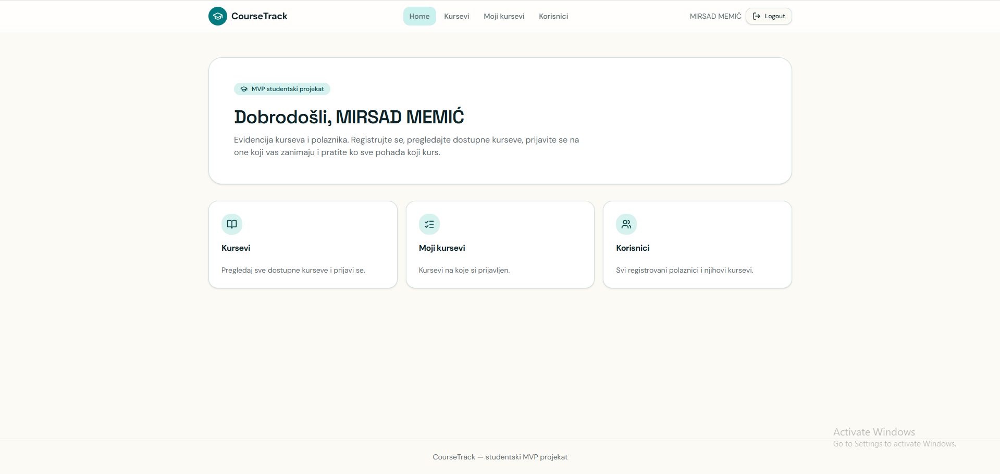

# 🎓 CourseTrack
## 📸 Screenshot



Moderna web aplikacija za upravljanje kursevima i polaznicima, izrađena pomoću **Reacta, TypeScripta i Supabasea**.

Aplikacija omogućava korisnicima da kreiraju nalog, prijave se, pregledaju dostupne kurseve i upravljaju svojim prijavama.

## 🚀 Live Demo

🔗 https://course-buddy-16.lovable.app

## ✨ Funkcionalnosti

* Registracija i prijava korisnika
* Pregled dostupnih kurseva
* Prijava na kurs
* Odjava sa kursa
* Pregled vlastitih kurseva
* Pregled registrovanih korisnika
* Detalji korisnika i njihovih kurseva
* Protected routes
* Responsive dizajn
* Validacija formi i prikaz grešaka

## 🛠️ Tech Stack

**Frontend**

React • TypeScript • Vite • React Router

**Backend & Database**

Supabase • PostgreSQL • Supabase Authentication

**Tools**

Git • GitHub • VS Code

## 📸 Preview


## 💡 O projektu

CourseTrack je razvijen kao praktičan full-stack web projekat sa glavnim fokusom na frontend development.

Kroz projekat sam radio sa React komponentama, routingom, autentifikacijom korisnika, bazom podataka i povezivanjem frontend aplikacije sa Supabase backend servisom.

## ⚙️ Pokretanje lokalno

```bash
git clone https://github.com/MirsadMemic/course-buddy-16.git
cd course-buddy-16
npm install
npm run dev
```

## 🎯 Šta sam naučio

* Organizacija React aplikacije kroz komponente
* Rad sa TypeScriptom
* React Router i protected routes
* Autentifikacija korisnika
* Rad sa Supabase API-jem
* Rad sa PostgreSQL bazom
* Responsive frontend dizajn
* Git i GitHub workflow

---

### 👨‍💻 Autor

**Mirsad Memić**

Frontend Developer fokusiran na React, TypeScript i moderne web tehnologije.

